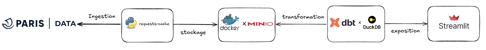

<div align="center">

# PARIS EVENTS ANALYZER


</div>

> [!NOTE]
> This repository is the codebase of the **Coding Dojo DevX** course on agentic development with GitHub Copilot.
> Start with [course/README.md](course/README.md).
>
> **DataNova** (logo and "Powered by DataNova" badge) is a **fictional** brand created for this training.
> It does not refer to any real company.

## About

This project showcases the open data published by the City of Paris to analyse cultural, sports and community events.

More information about the dataset: [Que Faire à Paris](https://opendata.paris.fr/explore/dataset/que-faire-a-paris-/).

### Architecture



> [!NOTE]
> The diagram shows the original MinIO object store. Snapshots are now written to a local `datalake/` directory,
> because MinIO community container images are no longer publicly available.

<details>
    <summary>Why these tools?</summary>

- **[Paris Open Data API](https://opendata.paris.fr/pages/home/)**: endpoints for many datasets, including city events.
- **[requests-cache](https://requests-cache.readthedocs.io/en/stable/)**: `requests` with a built-in cache, to avoid redundant API calls while iterating on the data.
- **Local datalake**: daily snapshots stored as `datalake/<format>/<YYYY-MM-DD>_data.<format>`.
- **[dbt](https://docs.getdbt.com/docs/introduction)** (dbt Core 1.x): modular, testable SQL transformations.
- **[DuckDB](https://duckdb.org/why_duckdb)**: a fast, embedded analytical database.
- **[Streamlit](https://docs.streamlit.io/)**: quick interactive web apps to explore the data.
</details>

### About "Que Faire à Paris"

**Que Faire à Paris** is the participatory events calendar of the City of Paris. Events and activities in Paris and its region are published on [paris.fr/quefaire](https://www.paris.fr/quefaire).

- The data covers venues such as the City's **libraries** and **museums**, **parks** and **gardens**, **community centres**, **swimming pools**, **theatres**, major venues (**Gaîté Lyrique**, **CENTQUATRE**, **Carreau du Temple**) and **concert halls**.
- It is updated **daily**.

### Data model

<details>
    <summary>Source columns</summary>

Example values come from the French source data and are kept as is.

| Column | Description | Type | Example |
| :--- | :--- | :--- | :--- |
| `id` | Unique event identifier. | VARCHAR | `315268` |
| `event_id` | Event template identifier (used by Algolia). | INTEGER | `12345` |
| `url` | Event page on the Que Faire à Paris website. | VARCHAR | `https://quefaire.paris.fr/fiche/315268-le-bel-ete-du-canal` |
| `title` | Event title. | VARCHAR | `Le Bel Été du Canal 2025` |
| `lead_text` | Introduction text. | VARCHAR | `Chaque été, le canal de l'Ourcq s'anime !` |
| `description` | Detailed description, as HTML. | VARCHAR | `<p>Rejoignez-nous pour la 18ème édition...</p>` |
| `date_start` | Start date and time. | TIMESTAMPTZ | `2025-07-05T10:00:00+02:00` |
| `date_end` | End date and time. | TIMESTAMPTZ | `2025-08-24T22:00:00+02:00` |
| `occurrences` | Individual time slots, `<start>_<end>` separated by `;`. Empty for many ongoing events. | VARCHAR | `2025-09-12T20:00:00+02:00_2025-09-12T22:00:00+02:00` |
| `date_description` | Text description (HTML) of dates and opening hours. | VARCHAR | `<p>Tous les samedis et dimanches...</p>` |
| `cover_url` | Cover image URL. | VARCHAR | `https://cdn.paris.fr/qfapv4/...jpg` |
| `cover_alt` | Alternative text of the cover image. | VARCHAR | `Personnes faisant du kayak...` |
| `cover_credit` | Cover image credits. | VARCHAR | `© Mairie de Paris` |
| `locations` | Venue information (JSON). | VARCHAR | `[{"accessibility": {...}, "address_street": ...}]` |
| `address_name` | Main venue name. | VARCHAR | `Bassin de la Villette` |
| `address_street` | Street address (number and street). | VARCHAR | `Quai de la Loire` |
| `address_zipcode` | Postal code. | VARCHAR | `75019` |
| `address_city` | City. | VARCHAR | `Paris` |
| `lat_lon` | Geographic coordinates. | GEOMETRY | `POINT (2.37 48.88)` |
| `pmr` | Accessible to people with reduced mobility. | INTEGER | `1 / 0` |
| `blind` | Accessible to visually impaired people. | INTEGER | `1 / 0` |
| `deaf` | Accessible to hearing impaired people. | INTEGER | `1 / 0` |
| `sign_language` | Sign language available. | VARCHAR | `1 / 0` |
| `mental` | Adapted for people with intellectual disabilities. | VARCHAR | `1 / 0` |
| `transport` | Public transport to the venue. | VARCHAR | `Métro 5 -> Jaurès` |
| `contact_url` | Official or contact website. | VARCHAR | `https://www.example.org` |
| `contact_phone` | Contact phone number. | VARCHAR | `01 00 00 00 00` |
| `contact_mail` | Contact email. | VARCHAR | `contact@example.org` |
| `contact_facebook` | Facebook page. | VARCHAR | `https://facebook.com/...` |
| `contact_twitter` | Twitter account. | VARCHAR | `https://twitter.com/...` |
| `price_type` | Pricing type. | VARCHAR | `gratuit / payant / gratuit sous condition` |
| `price_detail` | Price details (HTML). | VARCHAR | `<p>De 13 à 15 euros.</p>` |
| `access_type` | Access type (free entry, booking...). | VARCHAR | `libre / conseillee` |
| `access_link` | Booking or ticketing URL. | VARCHAR | `https://tickets.example.org` |
| `access_link_text` | Text of the booking link. | VARCHAR | `Réservez votre place ici` |
| `updated_at` | Last update of the event page. | TIMESTAMPTZ | `2025-06-12T15:00:00+02:00` |
| `image_couverture` | Technical field related to the cover image. | VARCHAR | |
| `programs` | Programmes or festivals the event belongs to. | VARCHAR | `L'Été du Canal ; Paris Plages` |
| `address_url` | Link to an online event. | VARCHAR | `https://example.org/live` |
| `address_url_text` | Extra information about the online event link. | VARCHAR | `Conférence en direct` |
| `address_text` | Extra venue details (building, floor...). | VARCHAR | `Retransmis depuis l'Auditorium` |
| `title_event` | Short event label. | VARCHAR | `Été du Canal` |
| `audience` | Target audience. | VARCHAR | `Tout public / Jeune public` |
| `childrens` | Suitable for children. | VARCHAR | `Oui, à partir de 6 ans / Non` |
| `group` | Suitable for groups. | VARCHAR | `Oui, sur réservation / Non` |
| `locale` | Main language of the event. | VARCHAR | `fr / en` |
| `rank` | Ranking or popularity score. | DOUBLE | `932.5` |
| `weight` | Undocumented weighting field. | INTEGER | `100` |
| `qfap_tags` | Categories, separated by `;`. | VARCHAR | `Humour;Théâtre` |
| `universe_tags` | Broader theme keywords. | VARCHAR | `Musique ; Loisirs` |
| `event_indoor` | Indoor (1) or outdoor (0). | INTEGER | `0 / 1` |
| `event_pets_allowed` | Pets allowed. | INTEGER | `1 / 0` |
| `contact_organisation_name` | Contact organisation name. | VARCHAR | `Association des Canaux de Paris` |
| `contact_url_text` | Text of the contact URL. | VARCHAR | `Visitez notre site` |
| `contact_vimeo`, `contact_deezer`, `contact_tiktok`, `contact_twitch`, `contact_spotify`, `contact_youtube`, `contact_bandcamp`, `contact_linkedin`, `contact_snapchat`, `contact_whatsapp`, `contact_instagram`, `contact_messenger`, `contact_pinterest`, `contact_soundcloud` | Social and media links. | VARCHAR | `https://...` |

</details>

## Prerequisites

- [uv](https://docs.astral.sh/uv/getting-started/installation/) (it installs Python 3.12 and `just` for you)
- git

No Docker, no credentials and no `.env` file are required.

## Installation

```bash
uv sync --locked --all-groups
uv pip install -e .
uv run just preflight
```

`just preflight` installs the git hooks and DuckDB extensions, then builds the warehouse on a small synthetic sample and runs all dbt tests. It ends with `PREFLIGHT OK`.

## Usage

| Goal | Command |
| :--- | :--- |
| List all recipes | `uv run just` |
| Offline build + all dbt tests (sample data) | `uv run just dbt-build-ci` |
| dbt unit tests only | `uv run just dbt-unit` |
| Lint SQL | `uv run just lint-sql` |
| All quality hooks | `uv run just quality-all` |
| App on the offline warehouse | `uv run just expose-ci` |
| Full pipeline on today's real data (network) | `uv run just final-workflow` |

dbt targets (`src/transformation/dbt_paris_event_analyzer/profiles/profiles.yml`):

- `prod`: today's snapshot from `datalake/`, written by `just ingest`.
- `ci`: the synthetic sample generated by `data/sample/generate_sample.py` (fictional events, dates relative to today).
- `lint`: in-memory, used by SQLFluff templating only.

## Author

- [CAprogs](https://github.com/CAprogs)
